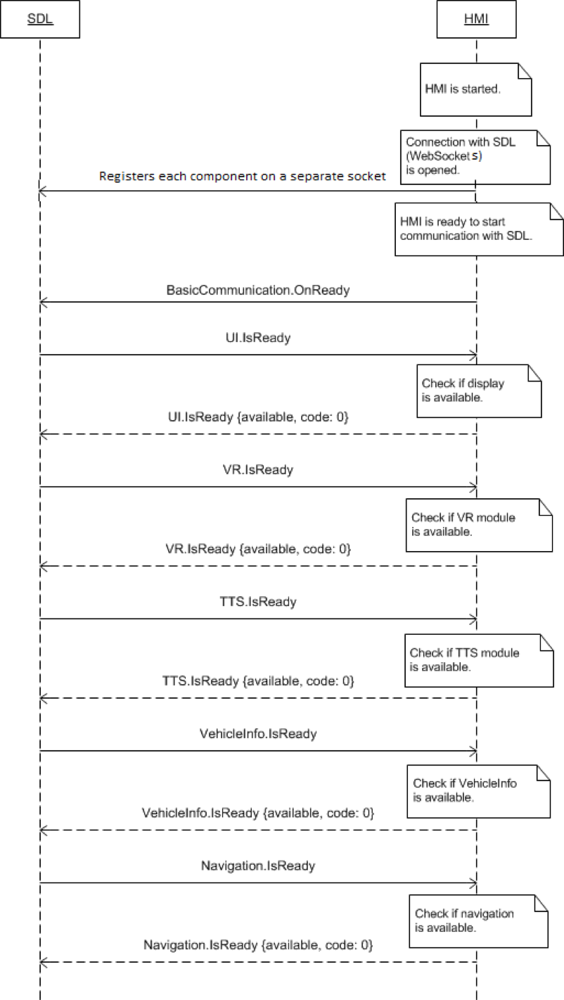

# 入门

## 组件就绪确认

HMI必须注册每一个组件, 该组件能通过以下格式与SDL进行通讯

```javascript
var JSONMessage = {
            "jsonrpc": "2.0",
            "id": -1,
            "method": "MB.registerComponent",
            "params": {
                "componentName": "UI"
            }
        };
```

可能的组件名称是 `UI`, `Buttons`, `BasicCommunication`, `VR`, `TTS`, `Navigation` 和 `VehicleInfo`

一旦这些组件被注册, HMI必须通知sdl, 它已经准备开始使用[BasicCommunication.OnReady](../BasicCommunication/OnReady)进行之后的通讯通知.

收到 OnReady 通知后，SDL 将开始通过响应链接请求来检查不同 HMI 组件的可用性：

  * `UI.IsReady` - 显示屏可用性
  * `VR.IsReady` - 语音识别模块可用性
  * `TTS.IsReady` - 语音合成模块可用性
  * `Navigation.IsReady` - 导航引擎可用性
  * `VehicleInfo.IsReady` - 指示是否可以收集和提供车辆信息。
 
## 通知注册Rdegistering for Notifications

HMI也必须通过以下RPC的格式注册每一条通知

```javascript
var obj = {
            "jsonrpc": "2.0",
            "id": -1,
            "method": "MB.subscribeTo",
            "params": {
                "propertyName": notificationName
            }
        }
```

`propertyName` 是通知(notification)的名字, 好比 `Buttons.OnButtonSubscription`

!!! must

HMI必须注册他的所有组件, 发送 `OnReady`的通知, 响应每一个 `IsReady` 的RPCs, 并且为每一个想要收到的通知进行注册.

!!!

!!! info

如果对任何组件 `IsReady` 请求的响应包含 `{"available": false}`，SDL 将不再与该组件进行通信。

!!!

### IsReady 序列图

!!! note

如果采用 WebSocket 连接，将在每个单独的 WebSocket 连接中发送对每个组件的 RPC。

!!!

|||
IsReady 序列

|||
